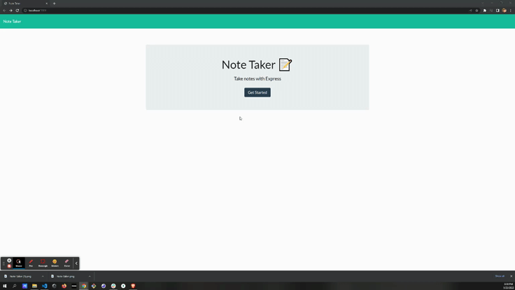

# Note-Taker

.png)

## Table of Contents

### [Installation](#installation)

### [Description](#description)

### [Usage](#usage)

### [License](#license)

### [Contributors](#contributors)

### [Contact](#contact)

## Description
 A note taking application for grocery lists, thoughts, or anything else you can think of

## Usage
Create, Save, and delete notes.

## Contributors
Jace Feinstein
Special thanks to tutor Eric Sayer for helping with application.

## Contact
Find me at https://github.com/jacef790

## References
Express routing. (n.d.). Express - Node.js web application framework. https://expressjs.com/en/guide/routing.html

Mohan, S. (2017, June 17). Util.promisify() in Node.js v8. Medium. https://medium.com/@suyashmohan/util-promisify-in-node-js-v8-d07ef4ea8c53

Node.js fs.writeFile() method. (2021, October 11). GeeksforGeeks. https://www.geeksforgeeks.org/node-js-fs-writefile-method/
